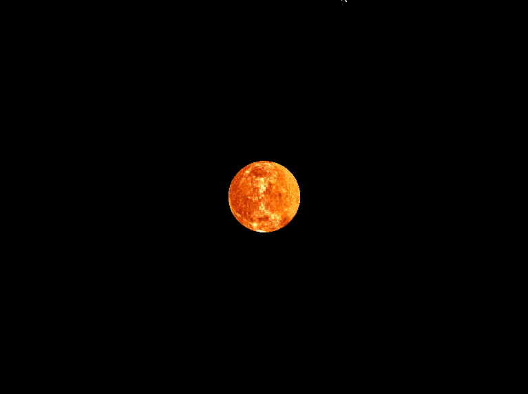
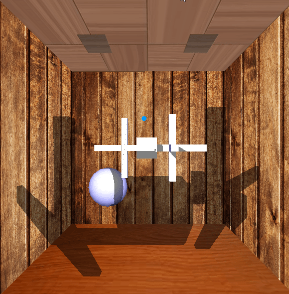
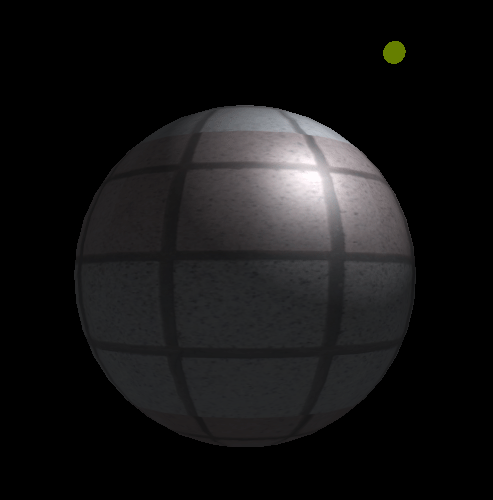

# 2017 Computer Graphics Assignments

## HW1

* Draw Planets with spin rotation along certain axis

* Preview: 

  

## HW2

* Draw Shadows using z-pass and z-fail algorithm

* Preview: 

  

## HW3

* Phong Shading & Normal Mapping

* Preview: 

* Other Effects: 

